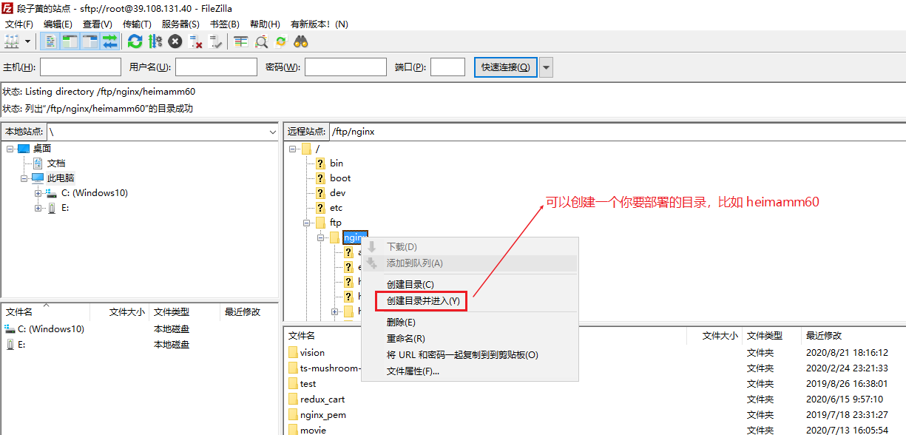

# 阿里云服务器搭建指南

## 购买

1. 打开购买链接：https://www.aliyun.com/1111/home?userCode=lgw8ufly
	
	
2. 点击立即购买，打开购买页面

   

3. 确认购买

   

4. 支付

   

## 启动云服务器

步骤：

1. 登录进入阿里云

   

2. 进入控制台

	

3. 点击进入云服务器ESC
	

4. 点击进行实例

   

5. 可以查看到你购买的实例列表

   

6. 点击更多，启动某个实例，那么服务器就启动成功了

   

7. 重置下实例的连接密码，并且重启实例
	
	
	
	

## 使用Git Bash连接到阿里云服务器

1. 打开`git bash`终端，里面输入`ssh root@你的阿里云公网IP地址`，按回车

   

2. 是否继续连接那里，选择`yes`，如果没有出现这一步，可以选择忽略

   

3. 输入阿里云实例的密码，进行连接

   

4. 连接成功之后，将有如下提示

   

## 安装Nginx

目的：为了运行我们自己打包好的前端代码

安装步骤：（在终端中按照如下指令进行输入，按回车即可）

1. 下载&编译&安装
    ```bash
    # 下载压缩包
    wget http://nginx.org/download/nginx-1.11.13.tar.gz

    # 解压
    tar -zxvf nginx-1.11.13.tar.gz
    cd nginx-1.11.13

    # 编译安装
    注意:在安装之前首先检查一下是否已安装nginx的一些模块依赖的lib库，诸如g++、gcc、pcre-devel、openssl-devel和zlib-devel。所以下面这些命令最好挨个跑一遍，已安装的会提示不用安装，未安装或需要更新的则会执行安装及更新：

    yum -y install gcc-c++  pcre pcre-devel  zlib zlib-devel openssl openssl-devel --setopt=protected_multilib=false 

    # 切换到nginx目录下，安装完依赖后下面就可以放心开始安装nginx了，输入安装命令并指定安装路径
    ./configure --prefix=/usr/local/nginx

    # 通过make以及make install进行编译安装
    make && make install

    # 启动
    /usr/local/nginx/sbin/nginx

    # 杀掉nginx进程
    killall -9 nginx
	```
	
2. 把Nginx做成服务

   ```bash
   # 新建nginx.service
   vim /lib/systemd/system/nginx.service
   
   # 在nginx.service中添加如下代码
   [Unit]  
   Description=The nginx HTTP and reverse proxy server  
   After=syslog.target network.target remote-fs.target nss-lookup.target  
   
   [Service]  
   Type=forking  
   PIDFile=/usr/local/nginx/logs/nginx.pid  
   ExecStartPre=/usr/local/nginx/sbin/nginx -t  
   ExecStart=/usr/local/nginx/sbin/nginx -c /usr/local/nginx/conf/nginx.conf  
   ExecReload=/bin/kill -s HUP $MAINPID  
   ExecStop=/bin/kill -s QUIT $MAINPID  
   PrivateTmp=true  
   
   [Install]  
   WantedBy=multi-user.target
   
   # 更改nginx.service的权限并让其可用
   chmod 745 nginx.service
   systemctl enable nginx.service
   
   # 查看nginx状态
   systemctl status nginx.service
   
   # 启动
   systemctl start nginx.service
   
   # 停止
   systemctl stop nginx.service
   
   # 重新启动
   systemctl reload nginx.service
   ```

3. 配置Nginx

   ```bash
   # 更改nginx端口号 & 运行文件夹
   
   # 首先找到配置文件在哪
   whereis nginx.conf
   cd /usr/local/nginx
   vim /usr/local/nginx/conf/nginx.conf
   
   # 修改如下地方
   server {
           listen       8080; # 端口号更改这里
           server_name  localhost;
   
           #charset koi8-r;
   
           #access_log  logs/host.access.log  main;
   
           location / {
               root   /ftp/nginx; # 运行文件夹所在位置
               index  index.html index.htm;
           }
   }
   ```

注意：

因为上面配置Nginx的时候，有设置root所在的文件夹，所以需要事先创建`ftp`和`nginx`文件夹

```bash
# 切换到服务器根目录
cd /

# 创建ftp文件夹
mkdir ftp

# 切换到ftp，创建nginx文件夹
cd ftp
mkdir nginx
```

## 安装FTP服务端和FTP客户端

目的：为了能把自己windows上面打包好的前端代码发布到服务器上面去

安装FTP服务端及配置

1. 安装VSFTP

   ```bash
   # 安装
   yum install vsftpd
   ```

2. 配置VSFTP

   ```bash
   # 打开配置
   vim /etc/vsftpd/vsftpd.conf
   
   # 更改配置
   把 anonymous_enable=YES 设置为 anonymous_enable=NO 不允许匿名登录FTP
   
   # 下面的可以暂时不执行
   vi /etc/ssh/sshd_config 
   将Subsystem      sftp    /usr/libexec/openssh/sftp-server 
   
   改为Subsystem       sftp    internal-sftp 
   ```

3. 对VSFTP服务的各种操作

   ```bash
   # 启动VSFTP服务
   systemctl start vsftpd.service
   
   # 停止VSFTP服务【暂时不需要执行】
   systemctl stop vsftpd.service
   
   # 重启VSFTP服务【暂时不需要执行】
   systemctl restart vsftpd.service
   
   # 查看VSFTP状态【暂时不需要执行】
   systemctl status vsftpd.service
   
   # 开机自动启动VSFTP服务
   systemctl enable vsftpd.service
   
   # 取消开机自动启动VSFTP服务【暂时不需要执行】
   systemctl disable vsftpd.service
   ```

4. 创建VSFTP用户及设置权限

   ```bash
   # 创建用户 /sbin/nologin：不允许此用户登录系统，但可以登录FTP
   useradd -d /ftp/WWW -s /sbin/nologin 你登录FTP的用户名
   
   # 设置用户密码 回车，输入密码即可（需输入两次）
   passwd 你登录FTP的用户名
   
   # 检查是否设置成功
   cat /etc/passwd 
   ```

安装FTP客户端，并且连接上FTP服务端

1. 在windows安装`FileZilla`这个软件

   

2. 连接到阿里云服务器

   

   

   

3. 把前端代码拖入你要上传的服务器文件夹下

   

   

## 域名配置 & 运行

上面的步骤整好之后，我们启动nginx，就可以运行我们的项目了，如果你还购买了域名，可以进行下域名绑定


最后，启动下nginx就可以查看效果了

```bash
# 启动
systemctl start nginx.service

# 查看nginx的状态
systemctl status nginx.service
```

nginx如果启动成功了，就可以在浏览中输入你的地址查看效果了

