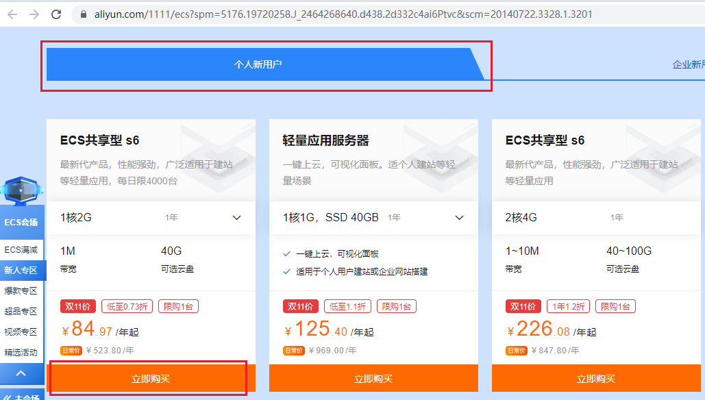
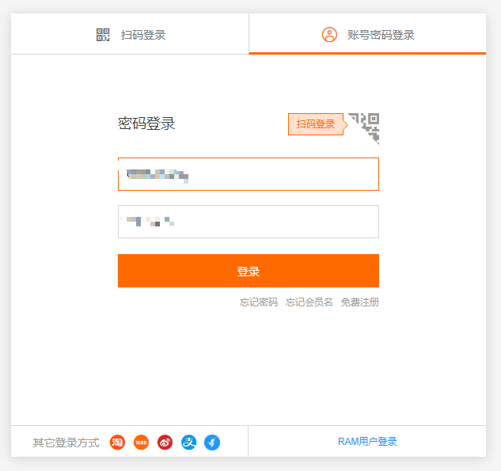

# 阿里云服务器搭建指南

## 购买

1. 打开购买链接：https://www.aliyun.com/1111/home?userCode=lgw8ufly
	
	
2. 点击立即购买，打开购买页面

   

3. 确认购买

   

4. 支付

   

## 启动云服务器

步骤：

1. 登录进入阿里云

   

2. 进入控制台

   

3. 点击进入云服务器ESC
	

4. 点击进行实例

   

5. 可以查看到你购买的实例列表

   

6. 点击更多，启动某个实例，那么服务器就启动成功了

   

## 使用Git Bash连接到阿里云服务器

​	

